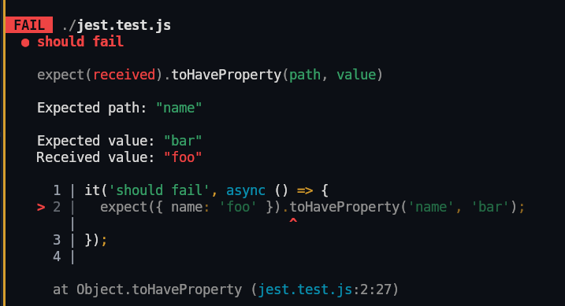
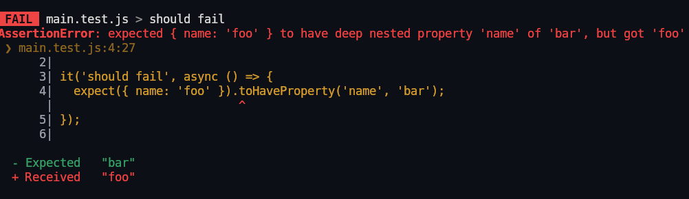
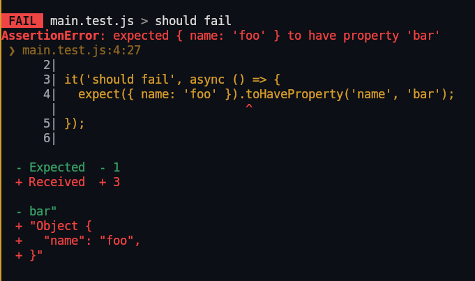
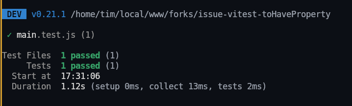
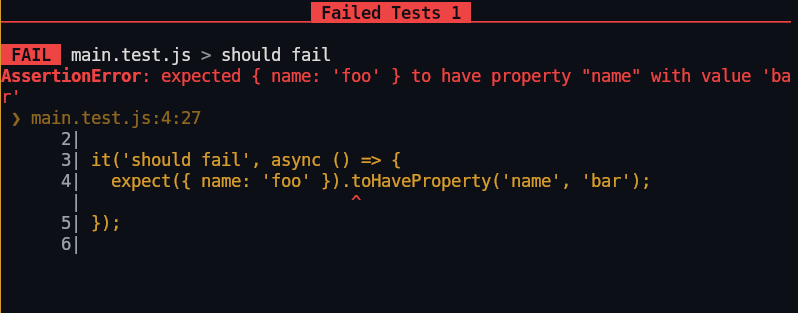
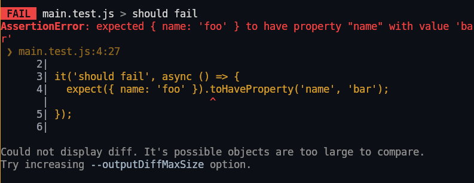
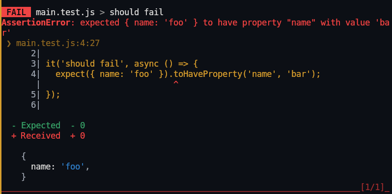
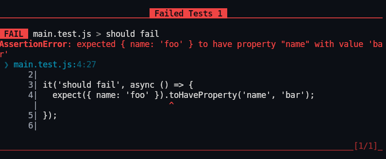
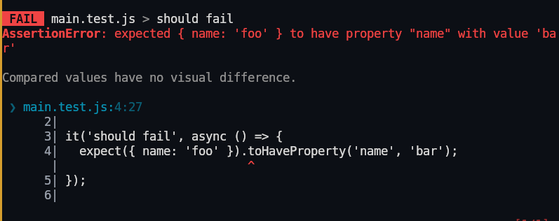

## jest 29.7.0

## vitest 0.12

Good error message, with a diff between expected and received.

## vitest 0.19

Less explicit error message, but still letting me see the whole object

## vitest 0.21 (?)

Seems like a regression because now the test is passing (?)

## vitest 0.23

Test is correctly failing again, but I don't have any context about what went wrong.

## vitest 0.26

There is now an error in diffs

## vitest 0.30

No more errors, the object is displayed, but no diff

## vitest 0.31

Back to no display at all, hard to debug.

## vitest 0.34

Now with a confusing "Compared values have no visual difference." message.

